# Flujos PDB — Mapa de procesos

Este documento describe los 11 procesos clave del PDB CRM y su relación con Dynamics. En todos los diagramas, los nodos azules pertenecen a **Dynamics** (sistema maestro) y los nodos verdes pertenecen al **PDB** (sistema operativo del broker). Los nodos amarillos representan el **LEAD**, punto de entrada de todo el funnel comercial. El sentido de las flechas indica el flujo natural del proceso; los retornos sombreados representan la sincronización automática Dynamics → PDB.

---

## 0. LEAD — Punto de entrada del funnel

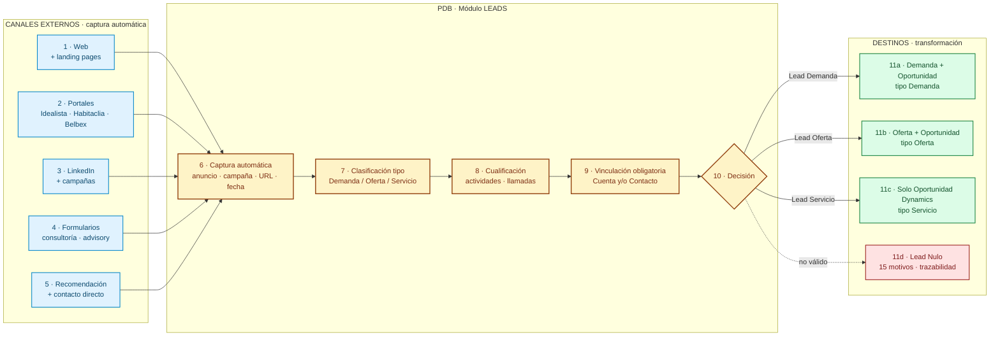

El módulo LEADS es **el verdadero origen del funnel**. La captura es **automática** desde múltiples canales (1–5): web corporativa, portales inmobiliarios (Idealista, Habitaclia, Belbex), LinkedIn, formularios de captación, recomendaciones, contacto directo y otros. Cada lead capturado registra automáticamente anuncio, campaña, URL, fecha y canal de origen (6). Se clasifica por tipo (7) — **Demanda**, **Oferta** o **Servicio** — y se cualifica con actividades (8). Para transformar es **obligatorio** vincular Cuenta o Contacto (9). Tras la decisión (10), el lead se transforma según su tipo (11a/b/c) o se cierra como Lead Nulo con motivo trazable (11d). Sin vinculación a Cuenta/Contacto, el lead no puede transformarse — esto evita oportunidades sin trazabilidad comercial.

---

## 1. Ciclo comercial completo (end-to-end)

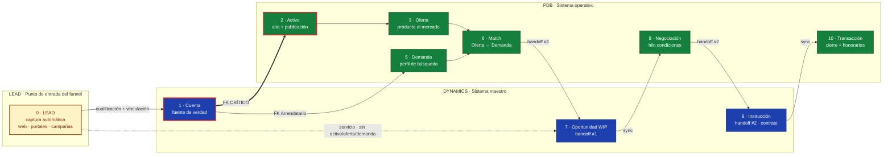

El ciclo arranca con el **LEAD** (0), que se captura automáticamente desde web, portales (Idealista, Habitaclia, Belbex), LinkedIn, formularios y campañas. Tras cualificarlo y vincularlo obligatoriamente a una **Cuenta** o Contacto en Dynamics (1), el flujo se bifurca según el tipo: los leads de Demanda y Oferta alimentan **Activos** (2), **Ofertas** (3), **Demandas** (5) en PDB, que machean (6) y disparan la **Oportunidad WIP** en Dynamics (7); los leads de Servicio van directos a Oportunidad sin pasar por activo/oferta/demanda. De ahí baja a **Negociación** (8), **Instrucción** (9) y se cierra como **Transacción** (10). El LEAD es el verdadero origen del funnel: ningún proceso comercial debería empezar sin él.

---

## 2. Cuentas

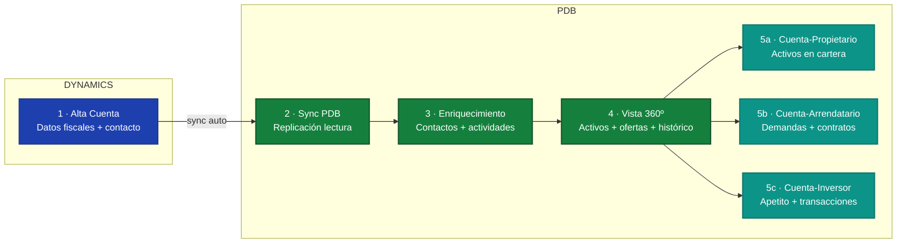

La cuenta se da de alta siempre en Dynamics (1), porque es el sistema maestro fiscal y de gobierno. El PDB recibe la sincronización (2), enriquece la cuenta con contactos y actividades (3) y construye una **vista 360º** (4). A partir de ahí, la cuenta toma uno de tres roles: **Propietario** de activos (5a), **Arrendatario** que ocupa espacios (5b) o **Inversor** que adquiere producto (5c). Una misma cuenta puede tener varios roles simultáneamente.

---

## 3. Oportunidades (WIP)

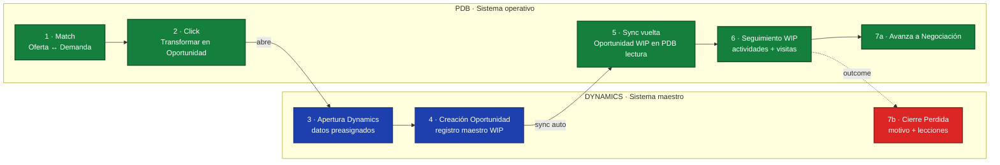

La Oportunidad **no es el origen del ciclo, es WIP intermedio**. Nace cuando hay un **match Oferta ↔ Demanda** (1) con tracción real en el PDB. El broker pulsa "Transformar en Oportunidad" (2), lo que abre Dynamics con los datos preasignados (3) para que el usuario complete y cree el registro maestro (4). Dynamics sincroniza la oportunidad de vuelta al PDB en modo lectura (5), donde el broker continúa el **seguimiento WIP** con actividades y visitas (6). El estado avanza a **Negociación** (7a) si hay tracción, o se cierra como **Perdida** en Dynamics (7b) con motivo. Es el primer cruce a Dynamics del ciclo comercial.

---

## 4. Gestión de Activo

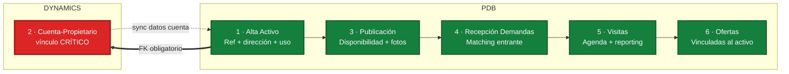

El alta del activo (1) es la primera operación que el broker realiza en el PDB. Antes de cualquier publicación, el activo **debe vincularse a una Cuenta-Propietario en Dynamics** (2): este FK es obligatorio y bloqueante. Una vez vinculado, el activo se publica con disponibilidad y fotos (3), recibe demandas entrantes (4), genera visitas (5) y, en su caso, ofertas (6). Toda la información heredable (titular, fiscal, contactos) se sincroniza desde la cuenta.

---

## 5. Gestión de Demanda

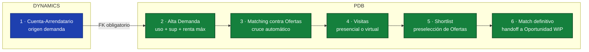

Toda demanda parte de una **Cuenta-Arrendatario** en Dynamics (1). El broker da de alta la demanda en el PDB (2) con el perfil de búsqueda (uso, superficie, renta máxima, zona). El sistema realiza un matching automático **contra las Ofertas publicadas** (3) — no contra activos sueltos: el activo está detrás de cada oferta, pero el cruce comercial es Demanda↔Oferta. Se ejecutan visitas (4) y se construye una shortlist de ofertas (5) hasta llegar al match definitivo (6) que dispara el handoff a Oportunidad WIP.

---

## 6. Flujo de Oferta

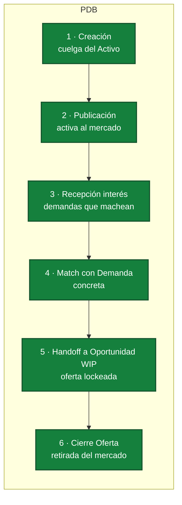

La oferta es el **producto disponible al mercado**: cuelga del Activo y existe antes de que llegue la demanda concreta que la captura. Se crea (1) sobre el activo con las condiciones publicables, se activa al mercado (2) y empieza a recibir interés de demandas que machean (3). Cuando una demanda concreta selecciona la oferta (4), se ejecuta el handoff a **Oportunidad WIP** (5) y la oferta queda lockeada — ya no admite nuevas demandas. Tras la transacción (o si se retira por otro motivo), la oferta se cierra (6) y desaparece del mercado activo. La oferta es el contenedor de mercado, no el contenedor de la transacción.

---

## 7. Negociación

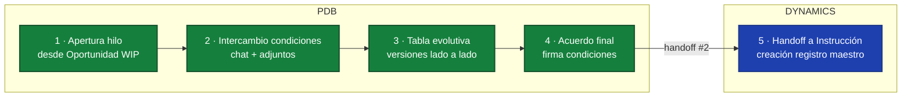

La negociación abre un hilo formal **a partir de la Oportunidad WIP** (1) — no directamente desde la oferta. Las partes intercambian condiciones documentadas en un chat con adjuntos (2), y el PDB mantiene una tabla evolutiva con todas las versiones lado a lado (3) para trazabilidad. Cuando se alcanza el acuerdo final (4), se ejecuta el **handoff #2 a Dynamics** (5) para crear la Instrucción maestra. **No existe contrato sin Instrucción en Dynamics.**

---

## 8. Instrucción / Transacción

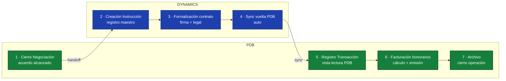

El cierre de la negociación (1) lanza la creación de la **Instrucción en Dynamics** (2), donde se formaliza el contrato con el visto bueno legal (3). Una vez firmado, Dynamics sincroniza el registro de vuelta al PDB (4), que lo muestra como **Transacción** en modo lectura (5). Sobre esa transacción se calculan y emiten los **honorarios** (6) y, finalmente, se archiva la operación (7). Este es el único camino válido para registrar ingresos.

---

## 9. Actividades y seguimiento

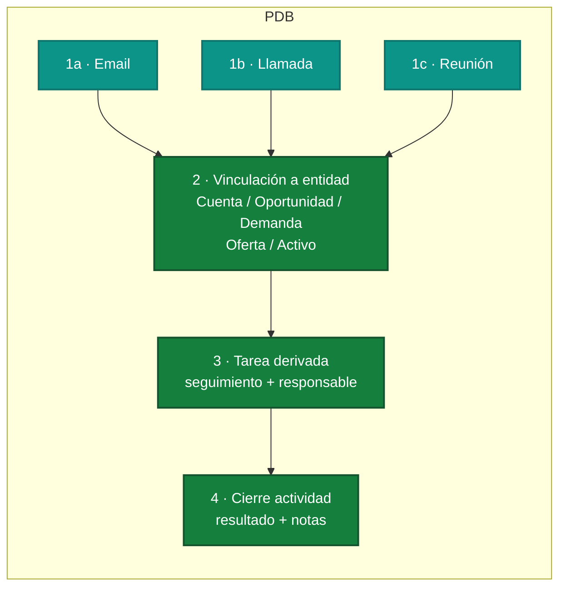

Las actividades son **transversales**: cualquier email (1a), llamada (1b) o reunión (1c) se registra en el PDB y debe vincularse obligatoriamente a una entidad — Cuenta, Oportunidad, Demanda, Oferta o Activo (2). De esa actividad puede derivar una **Tarea** (3) con responsable y fecha límite, que se cierra al ejecutarse con resultado y notas (4). Sin vinculación a entidad, la actividad no se persiste: no existen actividades huérfanas.

---

## 10. Vencimientos

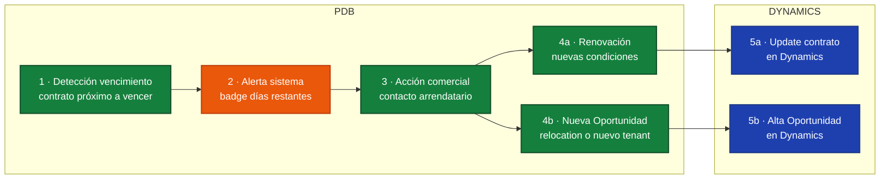

El motor de vencimientos del PDB detecta automáticamente los contratos próximos a expirar (1) y genera una alerta visible con badge de días restantes (2). El broker ejecuta la acción comercial sobre el arrendatario (3), que deriva en una **renovación** con condiciones actualizadas (4a) o en una **nueva Oportunidad** — relocation, tenant alternativo o salida (4b). Ambos resultados se reflejan en Dynamics (5a/5b) para mantener la fuente de verdad.

---

## Por qué vincular Cuentas a Activos es CRÍTICO

El vínculo **Activo → Cuenta-Propietario** no es un detalle de modelado: es la columna vertebral de todo el sistema. Saltárselo o dejarlo en blanco rompe el CRM en cadena.

- **La Cuenta es el nexo único con Dynamics.** Dynamics es la fuente de verdad fiscal, contractual y de gobierno. El PDB no inventa cuentas: las hereda. Un activo sin cuenta queda **huérfano**, sin titular real, sin contactos asociados, sin gobierno. No puede facturarse, no puede contratarse, no puede auditarse.

- **Vista 360º del Propietario.** Solo a través del vínculo se puede mostrar al equipo comercial todos los activos de un mismo propietario, sus vencimientos consolidados, las ofertas vivas en su cartera y el histórico de operaciones. Sin vínculo, el propietario aparece como una cadena de activos inconexos.

- **Inteligencia comercial en el módulo Mapas.** Los cruces que dan ventaja al broker — "qué cuentas tienen vencimientos en el eje Castellana", "qué propietarios concentran ofertas activas en Diagonal" — solo funcionan si cada activo conoce su cuenta. Sin el vínculo, el mapa pierde su capa analítica y se convierte en un visor estático.

- **Reporting y honorarios.** La facturación de honorarios depende de saber a qué cuenta pertenece cada operación. Un activo sin cuenta es una operación que no se puede liquidar contablemente y que rompe el reporting agregado por cliente.

- **Cross-selling.** El valor incremental del CRM está en detectar que el propietario del activo X también tiene los activos Y y Z, y que una operación en uno abre conversación sobre los otros. Sin vínculo, el cross-selling es invisible.

- **Riesgo operativo y calidad de dato.** Un activo sin cuenta es un fallo de calidad de dato que se propaga: contamina el matching de demandas, falsea los KPIs por propietario y obliga a limpiezas manuales costosas. La calidad del CRM se mide por el porcentaje de activos correctamente vinculados.

### Regla de oro

> **Ningún Activo sin Cuenta-Propietario.**
> **Ninguna Demanda sin Cuenta-Arrendatario.**
> **Ninguna Oferta sin ambas.**
