# Diagramas técnicos · PDB CRM — Base de datos y flujos

Documento técnico de la base de datos del PDB CRM, orientado a un ingeniero que tenga que mantener, ampliar o reimplementar el sistema. Cubre el modelo de entidades, los flujos operativos extremo-a-extremo y los state machines de cada entidad.

> **Convención:** todos los `flowchart` están en orientación horizontal (`LR`). Los `erDiagram` y `sequenceDiagram` son horizontales por defecto. El sistema vive sobre **PostgreSQL (Supabase)**. Los nodos en azul corresponden a **Microsoft Dynamics 365** (sistema maestro de cuenta, contacto, oportunidad, instrucción), los verdes a **PDB** (operativo del broker).

---

## 1. Vista de conjunto

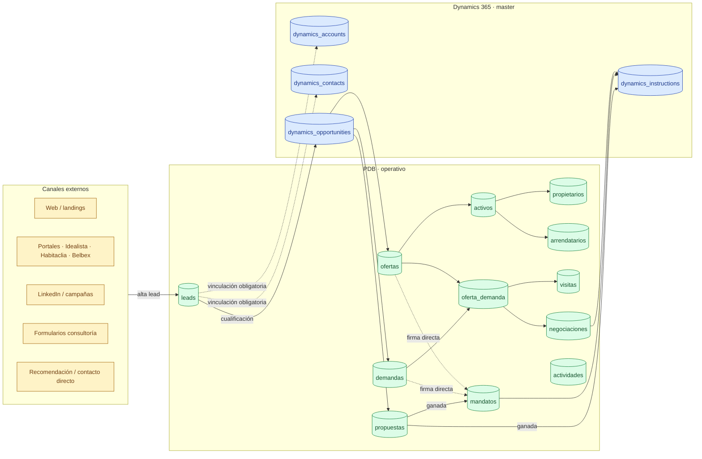

El flujo canónico **end-to-end** es:

```
Lead  →  Oportunidad  →  [Propuesta si pitch]  →  Instrucción  →  Mandato  →  sell-side / buy-side  →  Matching  →  Visita  →  Negociación  →  Cierre
```

---

## 2. Modelo de datos · diagrama de entidades (ERD)

```mermaid
erDiagram
  dynamics_accounts ||--o{ dynamics_contacts          : "tiene"
  dynamics_accounts ||--o{ dynamics_opportunities     : "es titular de"
  dynamics_contacts ||--o{ dynamics_opportunities     : "interlocutor"
  dynamics_opportunities ||--o| dynamics_instructions : "genera al ganar"
  dynamics_opportunities ||--o| propuestas            : "puede tener"
  dynamics_opportunities ||--o{ demandas              : "agrupa"
  dynamics_opportunities ||--o{ ofertas               : "agrupa"
  dynamics_opportunities ||--o| mandatos              : "puede tener"

  leads }o--o| dynamics_accounts          : "se vincula a"
  leads }o--o| dynamics_contacts          : "se vincula a"
  leads }o--o| dynamics_opportunities     : "genera al cualificar"
  leads }o--o| propuestas                 : "puede crear"
  leads }o--o| demandas                   : "puede crear"
  leads }o--o| ofertas                    : "puede crear"

  propuestas }o--o| mandatos              : "ganada -> mandato"
  demandas   }o--o| mandatos              : "firma directa"
  ofertas    }o--o| mandatos              : "firma directa"

  mandatos ||--o{ mandato_activos         : "cubre N activos"
  mandato_activos }o--|| activos          : "referencia"

  activos ||--o{ propietarios             : "tiene"
  activos ||--o{ arrendatarios            : "tiene"
  activos ||--o{ ofertas                  : "comercializa"

  ofertas  ||--o{ desglose_ofertas        : "espacios"
  ofertas  ||--o{ asignaciones_stacking   : "asigna a plantas"
  ofertas  ||--o{ plazas_oferta           : "incluye plazas"

  demandas ||--o{ oferta_demanda          : "matching"
  ofertas  ||--o{ oferta_demanda          : "matching"
  oferta_demanda ||--o{ visitas           : "se visita"
  oferta_demanda ||--o{ envios_ofertas    : "se envía"
  ofertas  ||--o{ negociaciones           : "negocia"

  arrendatarios ||--o{ vencimientos       : "tiene"

  actividades }o--o| leads
  actividades }o--o| ofertas
  actividades }o--o| demandas
  actividades }o--o| mandatos
  actividades }o--o| negociaciones
  actividades }o--o| activos
  actividades }o--o| dynamics_opportunities
```

### 2.1 Reglas estructurales

| Regla | Implementación |
|---|---|
| **Toda entidad operativa lleva FK a Cuenta + Oportunidad de Dynamics** | Columnas `dynamics_account_id` y `dynamics_opportunity_id` denormalizadas en `propuestas`, `demandas`, `ofertas`, `mandatos`, `actividades`. Triggers `BEFORE INSERT/UPDATE` (migración 011) las propagan. |
| **Mandato exige Oportunidad + Cuenta + Instrucción** | NOT NULL en `mandatos.dynamics_opportunity_id`, `dynamics_account_id`. La Instrucción se crea en cascada. |
| **Mandato tipo `alquiler` o `venta` exige ≥ 1 activo** | Validado en aplicación al crear/cerrar; `mandato_activos` es la tabla puente. |
| **Cancelar mandato exige motivo** | `mandato_cancelado_requires_motivo` CHECK constraint. |
| **Lead permisivo, Demanda/Mandato estricto** | `leads.dynamics_account_id` nullable hasta cualificación; `demandas.dynamics_account_id` NOT NULL. |
| **Propietario y Arrendatario nacen vinculados al Stacking** | `activo_ref` en ambas tablas; el alta solo es completa cuando se arrastra a una unidad del `activos.stacking_data` (jsonb). |
| **Stacking es la verdad de superficie ocupada** | Cualquier vista de m² ocupados debe leer del jsonb, no del campo libre del registro. |

### 2.2 Tablas y claves principales

| Tabla | PK | FKs externos clave | Notas |
|---|---|---|---|
| `dynamics_accounts` | `dynamics_id` (text) | — | Master Dynamics |
| `dynamics_contacts` | `dynamics_id` | `cuenta_dynamics_id → dynamics_accounts` | Master Dynamics |
| `dynamics_opportunities` | `dynamics_id` | `cuenta_dynamics_id`, `contacto_dynamics_id` | 5 tipos: pitch_demanda, demanda, pitch_oferta, oferta, generica |
| `dynamics_instructions` | `dynamics_id` | `oportunidad_dynamics_id` | Estado: kickoff → en_curso → cerrada |
| `leads` | `id` (uuid), unique `ref` | dyn_account/contact/opportunity, propuesta_id, demanda_id, oferta_id | Tipos: oferta, demanda, generico. Vías: pitch / directo |
| `propuestas` | `id`, unique `ref` | `dynamics_opportunity_id` (NOT NULL), `dynamics_account_id` (NOT NULL), `lead_id` | Estados: borrador, enviada, ganada, perdida, cancelada |
| `demandas` | `id`, unique `ref` | `dynamics_opportunity_id` (NOT NULL), `dynamics_account_id` (NOT NULL), `mandato_id` (nullable) | Estatus: ongoing, paralizada, descartada, cerrada_concedido, cerrada_perdida |
| `ofertas` | `id`, unique `ref` | `activo_id`, `demanda_id`, `mandato_id` (nullable), dyn_*  | Estado: Disponible, Reservada, Ocupada total, Retirada... `activa` boolean |
| `mandatos` | `id`, unique `ref` | dyn_*, `dynamics_instruction_id` (NOT NULL), `propuesta_id` | Estados: en_curso, cerrado, cancelado. Tipo: alquiler / venta / demanda / consultoria. Vía: pitch / directo. Modo exclusividad: exclusiva / coexclusiva |
| `mandato_activos` | `id` | `mandato_id` (CASCADE), `activo_id`. UNIQUE (mandato_id, activo_id) | Tabla puente multi-activo |
| `activos` | `id`, unique `ref` | — | Stacking en `stacking_data` jsonb |
| `propietarios` | `id` (text, ej. 'PRO-...') | `activo_ref` (text → `activos.ref`) | Estado: activo, vendido, desinversion, inactivo |
| `arrendatarios` | `id`, unique `ref` ('ARR-...') | `activo_ref` | `tenant_desconocido` boolean. Estado_arr: Vigente, Renovado, Finalizado, En negociación |
| `oferta_demanda` | `id` | `oferta_id`, `demanda_id`, `activo_id`, `portfolio_id`. UNIQUE(oferta_id, demanda_id) | Tabla puente "Alternativas" |
| `visitas` | `id` | `oferta_demanda_id`, `oferta_id`, `activo_id`, `demanda_id` | Resultado: positiva / neutral / negativa |
| `envios_ofertas` | `id` | `demanda_id`, `oferta_demanda_ids[]` | Canal: email, presencial, llamada |
| `negociaciones` | `id` | `oferta_id`, `oferta_demanda_id`, `demanda_id`, cuenta_inquilina_id, cuenta_propietaria_id | Documentos versionados en jsonb |
| `actividades` | `id` | `lead_id`, `oferta_id`, `demanda_id`, `mandato_id`, `negociacion_id`, `activo_id`, `oportunidad_dynamics_id` | Tipo: email, llamada, reunion, nota, tarea |
| `vencimientos` | `id` | `arrendatario` (legacy) | Hoy se computa on-the-fly desde arrendatarios |
| `asignaciones_stacking` | `id` | `activo_id`, `oferta_id`, `desglose_oferta_id`. UNIQUE(activo+edif+planta+desglose) | Capa comercial sell-side |
| `desglose_ofertas` | `id` | `oferta_id` | Espacios divisibles dentro de una oferta |
| `caracteristicas_oferta` | `id` | `oferta_id` | Filtro de features incluidas en la ficha |
| `plazas_oferta` | `id` | `oferta_id` | Plazas de parking comercializadas |

---

## 3. Flujos operativos

### 3.1 F-CAP · Captura del Lead

```mermaid
flowchart LR
  subgraph SRC[Canales]
    direction LR
    web[Web / landing]
    port[Portales]
    li[LinkedIn]
    rec[Recomendación]
  end
  cap[Captura<br/>origen_canal · origen_campana<br/>origen_anuncio · origen_url]
  classify{tipo}
  oferta_lead[Lead tipo<br/>oferta]
  demanda_lead[Lead tipo<br/>demanda]
  generic_lead[Lead tipo<br/>generico]
  ins[(INSERT leads<br/>estado='nuevo'<br/>via=null<br/>equipo_trabajo=[])]

  SRC --> cap --> classify
  classify -->|propietario quiere comercializar| oferta_lead --> ins
  classify -->|cliente busca espacio| demanda_lead --> ins
  classify -->|consultoría / valoración / advisory| generic_lead --> ins
```

**Tablas tocadas:** `leads`.
**Side-effects:** ninguno aún (cuenta y contacto se vinculan en cualificación).

### 3.2 F-CUAL · Cualificación Lead → Oportunidad + downstream

Punto único de entrada al funnel comercial. El broker decide **pitch vs directo** y se ejecuta una de seis cascadas.

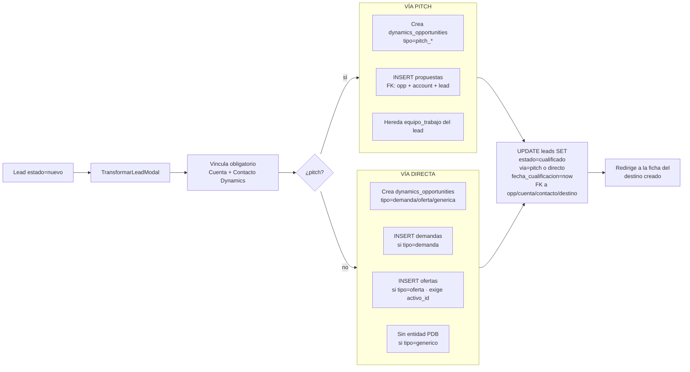

**Componente:** `src/components/TransformarLeadModal.jsx`.
**Side-effects ordenados:**
1. INSERT `dynamics_opportunities` (id auto: `dyn-opp-<timestamp>`).
2. INSERT en la tabla destino (`propuestas` | `demandas` | `ofertas`) con `equipo_trabajo` heredado.
3. UPDATE `leads`: `estado='cualificado'`, `fecha_cualificacion`, FKs.
4. Auto-detección de duplicados: leads con mismo email/teléfono + demandas activas de la misma cuenta. **No bloquean**, requieren acuse de recibo.

### 3.3 F-PITCH · Cascada Propuesta ganada → Mandato

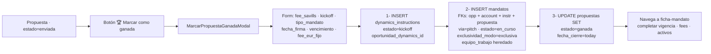

**Componente:** `src/components/MarcarPropuestaGanadaModal.jsx`.
**Validaciones (puede=false si):** propuesta ya cerrada, sin oportunidad Dynamics, sin cuenta.
**Ref del mandato:** `nextMandatoRef()` → `MAN-YYYY-NNNN` consultando `MAX(ref) + 1` por año.

### 3.4 F-FIRM · Firma directa de Mandato (post-hoc)

Una Demanda u Oferta puede vivir sin mandato firmado (mayoría de casos: sub-brokering, búsqueda con varias consultoras, oferta de mandato ajeno). Cuando el cliente formaliza el acuerdo, se "eleva" la entidad a mandato.

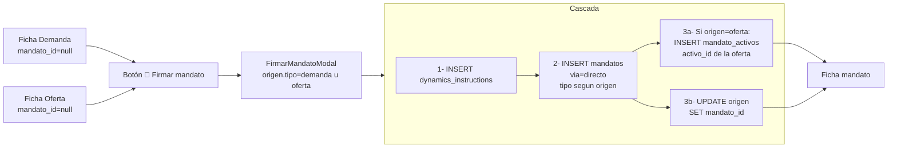

**Componente:** `src/components/FirmarMandatoModal.jsx`.
**Tipo del mandato (sugerido):**
- `origen=demanda` → `demanda` o `consultoria`.
- `origen=oferta` con tipo_operacion=Venta → `venta`.
- `origen=oferta` con tipo_operacion=Alquiler → `alquiler`.

**Importante:** desde `MandatosList` no hay botón "+ Nuevo Mandato". El mandato siempre nace de un origen previo (Propuesta ganada, Demanda existente u Oferta existente).

### 3.5 F-MAN-LIFE · Lifecycle del Mandato

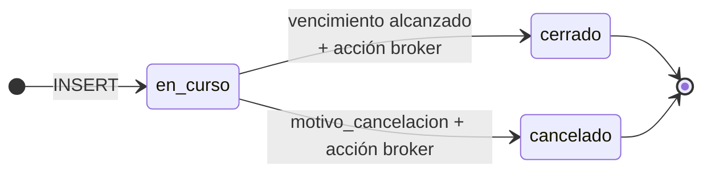

**Cancelación / Cierre — decisión sobre las ofertas vinculadas:**

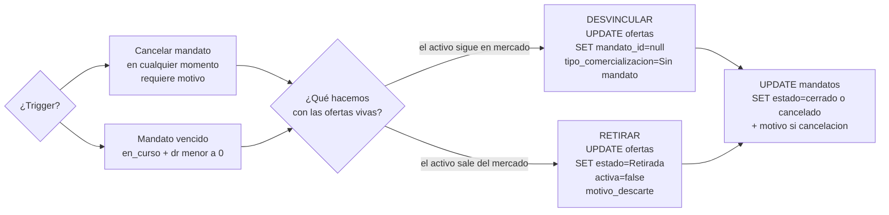

**Motivos predefinidos de cancelación:**
- Cliente cancela el encargo
- Pérdida de competitividad de Savills
- Cambio de estrategia del cliente
- Activo vendido / alquilado fuera de Savills
- Conflicto de interés
- Problema de compliance / KYC
- Otro motivo (texto libre)

### 3.6 F-STACK · Stacking Plan del Activo

`activos.stacking_data` es un `jsonb` con la siguiente estructura:

```json
[
  {
    "id": "A",
    "label": "Edif. A",
    "supPlantaTipo": 1500,
    "floors": [
      { "id": "P5", "sup": 1500,
        "principal": [{ "uso": "oficinas", "sup": 1500 }],
        "adicional": [] }
    ],
    "prop": [
      { "p": "P5", "sup": 1500,
        "units": [{ "prop_id": "PRO-1714...", "n": "Barings", "sup": 1500 }] }
    ],
    "arr": [
      { "p": "P5", "sup": 1500,
        "units": [
          { "type": "ten", "arr_ref": "ARR-1714...", "n": "Celonis", "sup": 1202, "brk": "Oct 2025" },
          { "type": "vac", "oferta": "OFR-0017", "sup": 298 }
        ]
      }
    ]
  }
]
```

**Tipos de unit en la capa `arr`:**

| `type` | Significado | Campos clave |
|---|---|---|
| `ten` | Tenant (arrendatario asignado) | `arr_ref`, `n`, `sup`, `brk`, `brkColor` |
| `vac` | Espacio vacante / disponible | `oferta` (ref), `sup` |
| `com` | Espacio común / hall | `n`, `sup` |
| `rt` | Retail tenant | `n`, `sup`, `brk` |
| `pk` | Parking | `n`, `sup`, `nota` |

**Flujo de drag & drop (capa `arr`):**

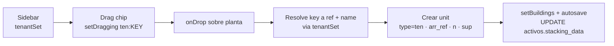

**Identidad estable:** cada unit `ten` lleva `arr_ref` (= `arrendatarios.ref`), cada unit `prop` lleva `prop_id` (= `propietarios.id`). Permite renames sin romper match y disambigua múltiples "Desconocido" coexistentes en el mismo activo.

### 3.7 F-PROP · Alta de Propietario

```mermaid
flowchart LR
  act[Ficha Activo · tab Stacking]
  add[+ Añadir propietario]
  fp[FichaPropietario<br/>fromActivoRef]
  form[Form datos del propietario]
  upsert[UPSERT propietarios<br/>id=PRO-timestamp<br/>activo_ref=fromActivoRef]
  back[Vuelve a FichaActivo<br/>newOwnerData]
  panel[Aparece como chip en sidebar<br/>capa prop]
  drag[Broker arrastra chip<br/>a una planta]
  unit[Crea unit<br/>prop_id · n · sup]

  act --> add --> fp --> form --> upsert --> back --> panel --> drag --> unit
```

**Sin asignar al stacking:** el registro existe en `propietarios` pero no está en `activos.stacking_data`. Contablemente la superficie del activo está incompleta (banner ⚠ en la ficha).

### 3.8 F-ARR · Alta de Arrendatario

Idéntico al de propietario salvo que la **auto-asignación al stacking sí ocurre** si se vino desde el flujo "Convertir oferta en arrendatario" (cuando una oferta se firma).

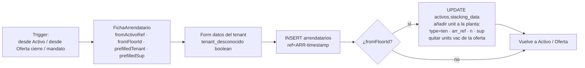

**Caso "tenant desconocido":** `nombre='Desconocido'`, `tenant_desconocido=true`. Pueden coexistir varios en el mismo activo — se distinguen por `arr_ref`.

### 3.9 F-VENC · Vencimientos y deal-flow

`VencimientosView` cruza tres queries en paralelo:

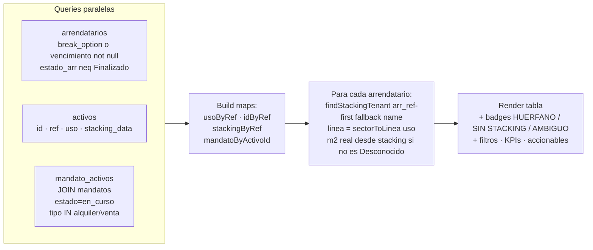

**Tres acciones canónicas confirmadas en spec:**

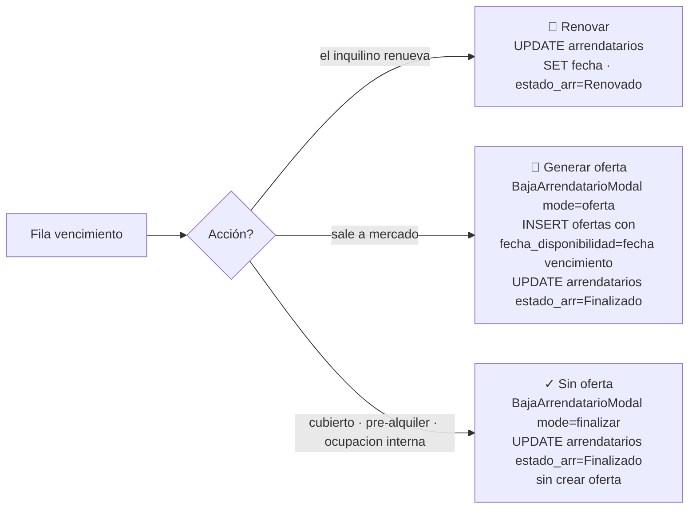

**Regla:** nunca generar oferta automática "porque sí". El broker decide.

### 3.10 F-MATCH · Matching Demanda → Pool de Ofertas

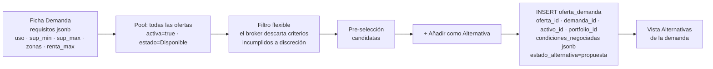

`condiciones_negociadas` es snapshot — los cambios posteriores en la oferta no se propagan automáticamente a las alternativas existentes.

### 3.11 F-ENVIO · Envío al cliente + Microsite

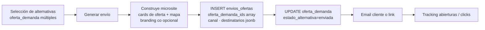

### 3.12 F-VISITA · Visitas trazables

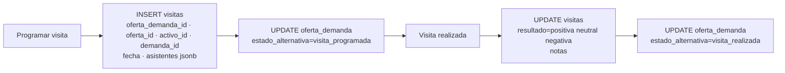

Las visitas son **trazables triple**: la fila vive en `visitas` con FKs a `oferta_demanda` (alternativa), `oferta`, `activo` y `demanda`. Cualquier vista de las cuatro entidades puede mostrar las visitas relacionadas.

### 3.13 F-NEG · Negociación y cierre

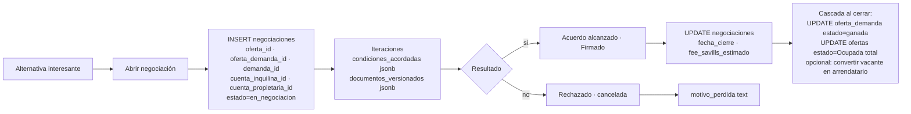

### 3.14 F-DYN · Sincronización Dynamics ↔ PDB

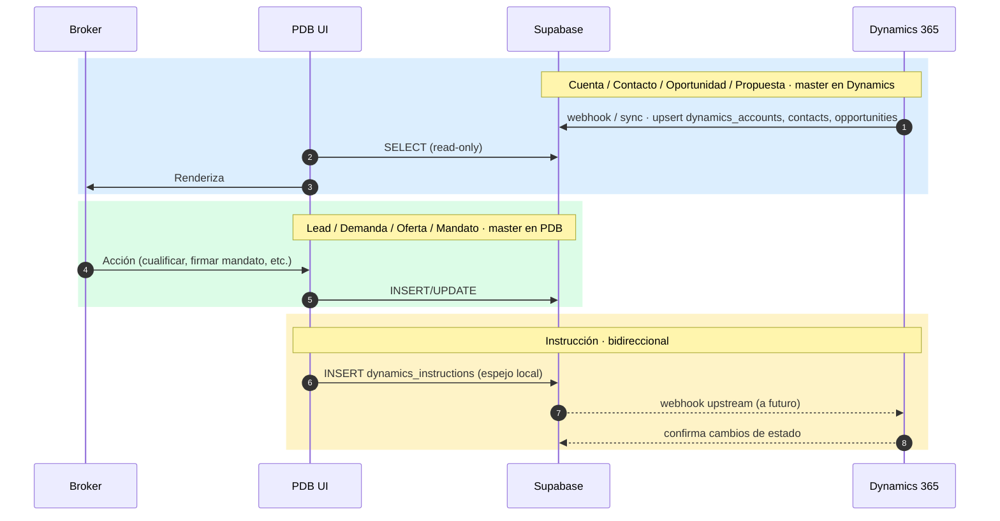

**Estado actual:** los `dynamics_*` se simulan creando filas locales (`dyn-opp-<ts>`, `dyn-ins-<ts>`). En producción el contrato es:

| Entidad | Master | PDB hace |
|---|---|---|
| `dynamics_accounts` | Dynamics | Read-only |
| `dynamics_contacts` | Dynamics | Read-only |
| `dynamics_opportunities` | Dynamics | Read-only · puede solicitar creación al cualificar |
| `dynamics_instructions` | Dynamics | Lectura + escritura colaborativa |
| `propuestas` | Dynamics | Read-only (espejo local) |
| `mandatos` | PDB | Read/write completo |
| Resto | PDB | Read/write completo |

### 3.15 F-CONF · Confidencialidad

Implementado en `FichaOferta` y `FichaDemanda`. Pendiente de replicar en `FichaMandato`.

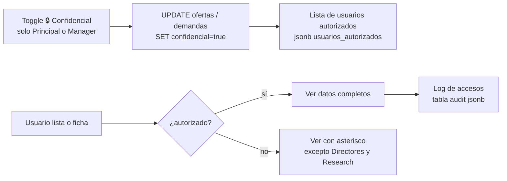

**Reglas:**
- Solo Principal del equipo o Manager pueden activar.
- Directores y rol Research bypassean (ven completo).
- Solicitar acceso → notifica al Principal.

### 3.16 F-EQ · Equipo de trabajo

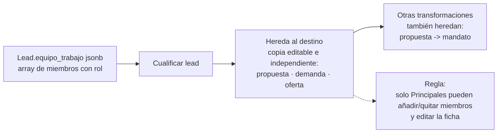

`equipo_trabajo` es un jsonb array `[{nombre, rol, fecha_alta}]` con roles: `Principal`, `Soporte`, `Colaborador`. Componente `EquipoTrabajoCard` + helper `makeEquipoHandlers` en `src/components/EquipoTrabajoCard.jsx`.

---

## 4. State machines de las entidades

### 4.1 leads.estado

```mermaid
stateDiagram-v2
  direction LR
  [*] --> nuevo
  nuevo --> en_cualificacion: actividades · llamadas
  en_cualificacion --> cualificado: TransformarLeadModal éxito
  en_cualificacion --> no_cualificado: motivo_no_cualificado
  cualificado --> [*]
  no_cualificado --> [*]
```

### 4.2 propuestas.estado

```mermaid
stateDiagram-v2
  direction LR
  [*] --> borrador
  borrador --> enviada
  enviada --> ganada: MarcarPropuestaGanadaModal
  enviada --> perdida: motivo_descarte
  enviada --> cancelada
  ganada --> [*]
  perdida --> [*]
  cancelada --> [*]
```

### 4.3 mandatos.estado

```mermaid
stateDiagram-v2
  direction LR
  [*] --> en_curso
  en_curso --> cerrado: cierre por vencimiento
  en_curso --> cancelado: motivo_cancelacion
  cerrado --> [*]
  cancelado --> [*]
```

### 4.4 demandas.estatus

```mermaid
stateDiagram-v2
  direction LR
  [*] --> ongoing
  ongoing --> paralizada
  paralizada --> ongoing
  ongoing --> descartada: motivo_descarte
  ongoing --> cerrada_concedido: matching ganado
  ongoing --> cerrada_perdida: motivo_descarte
  descartada --> [*]
  cerrada_concedido --> [*]
  cerrada_perdida --> [*]
```

### 4.5 ofertas.estado + activa

```mermaid
stateDiagram-v2
  direction LR
  [*] --> Disponible: activa=true
  Disponible --> Reservada: pre-acuerdo
  Reservada --> Disponible: cae el deal
  Reservada --> Ocupada_total: contrato firmado<br/>activa=false
  Disponible --> Retirada: mandato cerrado / propietario retira<br/>activa=false<br/>motivo_descarte
  Reservada --> Retirada
  Ocupada_total --> [*]
  Retirada --> [*]
```

### 4.6 oferta_demanda.estado_alternativa

```mermaid
stateDiagram-v2
  direction LR
  [*] --> propuesta
  propuesta --> enviada: envios_ofertas
  enviada --> visita_programada: INSERT visitas
  visita_programada --> visita_realizada: resultado
  visita_realizada --> negociando: open negociacion
  negociando --> ganada
  negociando --> perdida: motivo_perdida
  enviada --> descartada: cliente descarta
  ganada --> [*]
  perdida --> [*]
  descartada --> [*]
```

### 4.7 negociaciones.estado

```mermaid
stateDiagram-v2
  direction LR
  [*] --> en_negociacion
  en_negociacion --> pendiente_respuesta
  pendiente_respuesta --> en_negociacion
  en_negociacion --> acuerdo_alcanzado
  acuerdo_alcanzado --> firmado
  en_negociacion --> rechazado: motivo_perdida
  firmado --> [*]
  rechazado --> [*]
```

### 4.8 arrendatarios.estado_arr

```mermaid
stateDiagram-v2
  direction LR
  [*] --> Vigente
  Vigente --> Proximo_vencimiento: dr menor a 90
  Proximo_vencimiento --> En_negociacion
  En_negociacion --> Renovado: nueva fecha
  En_negociacion --> Finalizado: salida
  Vigente --> Renovado
  Vigente --> Finalizado
  Renovado --> Vigente
  Finalizado --> [*]
```

### 4.9 propietarios.estado

```mermaid
stateDiagram-v2
  direction LR
  [*] --> activo
  activo --> vendido: tras cierre venta
  activo --> desinversion: programada
  desinversion --> vendido
  activo --> inactivo: pausa
  inactivo --> activo
  vendido --> [*]
```

---

## 5. Identidad estable en `stacking_data`

Las units `type='ten'` llevan `arr_ref` (= `arrendatarios.ref`); las units de la capa `prop` llevan `prop_id` (= `propietarios.id`). El match unit ↔ registro sigue esta prioridad:

```mermaid
flowchart LR
  match[Buscar unit del registro X]
  step1{¿X.ref existe en algun unit.arr_ref?}
  step2{¿algun unit sin arr_ref tiene unit.n = X.nombre?}
  found[Match · sumar sup]
  none[No asignado · huerfano]

  match --> step1
  step1 -->|sí| found
  step1 -->|no| step2
  step2 -->|sí| found
  step2 -->|no| none
```

**Caso especial — "Desconocido":** si `arrendatarios.tenant_desconocido=true` o nombre='Desconocido', el match por nombre es ambiguo cuando hay múltiples Desconocido en el mismo activo. La UI marca:
- ⚠ HUÉRFANO — tenant identificado, sin presencia en stacking.
- ⚠ SIN STACKING — Desconocido sin ninguna unidad Desconocido.
- 🆔 AMBIGUO — varias units Desconocido y match no fiable.

---

## 6. Triggers y FKs denormalizadas (migración 011)

Cada tabla operativa lleva FK denormalizadas a sus padres para permitir la **vista 360º** con una sola query. Triggers `BEFORE INSERT/UPDATE` propagan automáticamente.

```mermaid
flowchart LR
  src[INSERT u UPDATE en demandas u ofertas u mandatos]
  trig[Trigger BEFORE]
  src_fk{¿faltan FKs denormalizadas?<br/>account_id · activo_id · portfolio_id}
  derive[Derivar desde la cadena:<br/>oportunidad y mandato y activo<br/>de los FKs ya presentes]
  apply[Aplicar al row antes de persistir]
  done[Persistencia final]

  src --> trig --> src_fk
  src_fk -->|sí| derive --> apply --> done
  src_fk -->|no| done
```

**Resultado:** una query a `actividades` (o cualquier tabla operativa) puede filtrar por cualquier nivel de la jerarquía sin joins. La vista 360º del Activo / Cuenta / Portfolio es directa.

---

## 7. Sincronización · matriz de masters

| Entidad | Master | PDB lee | PDB escribe |
|---|---|---|---|
| dynamics_accounts | Dynamics | sí | no (read-only) |
| dynamics_contacts | Dynamics | sí | no |
| dynamics_opportunities | Dynamics | sí | solicita creación al cualificar lead |
| dynamics_instructions | Dynamics | sí | sí (bidireccional) |
| propuestas | Dynamics | sí | mirror local; cambios suben a Dynamics |
| leads | PDB | sí | sí (master local) |
| demandas | PDB | sí | sí |
| ofertas | PDB | sí | sí |
| mandatos | PDB | sí | sí |
| activos | PDB | sí | sí |
| propietarios | PDB | sí | sí |
| arrendatarios | PDB | sí | sí |

---

## 8. Confidencialidad y permisos cross-equipo

- **Lectura:** libre cross-equipo (todos los brokers ven todo lo que no es confidencial).
- **Edición:** restringida al `equipo_trabajo` de la entidad. Solo `Principal` puede editar.
- **Confidencialidad:** activable solo por Principal o Manager. Usuarios no autorizados ven los campos sensibles enmascarados con `*` (excepción: rol `Director` y rol `Research` ven todo).
- **Audit log:** inmutable, accesible solo por rol `admin`.

---

## 9. Notas de implementación

### 9.1 Generación de refs

| Entidad | Patrón | Generador |
|---|---|---|
| Lead | `LEAD-YYYY-NNNN` | DB-side trigger |
| Propuesta | `PRY-YYYY-NNNN` | App: `nextRef('PRY')` |
| Demanda | `DEM-YYYY-NNNN` | App: `nextRef('DEM')` |
| Oferta | `OFE-YYYY-NNNN` | App: `nextRef('OFE')` |
| Mandato | `MAN-YYYY-NNNN` | App: `nextMandatoRef()` |
| Arrendatario | `ARR-<timestamp>` | App: `'ARR-' + Date.now()` |
| Propietario | `PRO-<timestamp>` | App: `'PRO-' + Date.now()` |

`nextRef(prefix)` consulta `MAX(ref)` para el año y suma 1. Race condition aceptada en el prototipo; en producción sustituir por SEQUENCE PostgreSQL.

### 9.2 jsonb relevantes

- `mandatos.fee_sliding_jsonb` — escala de fee por tramos (`[{ desde, hasta, pct }]`).
- `mandatos.fee_compartido_jsonb` — `{ reparto: [{ nombre, tipo: interno|externo, porcentaje, equipo, miembro, agencia_id }] }`. La suma de `porcentaje` debe ser 100.
- `mandatos.equipo_trabajo` — `[{ nombre, rol, fecha_alta }]`. Idem para todas las entidades downstream.
- `activos.stacking_data` — descrito en §3.6.
- `demandas.requisitos` — criterios de búsqueda (`uso, sup_min, sup_max, zonas, renta_max`).
- `oferta_demanda.condiciones_negociadas` — snapshot al añadir como alternativa.
- `negociaciones.condiciones_acordadas` — diff acumulado durante la negociación.
- `negociaciones.documentos_versionados` — array de versiones de borradores de contrato.

### 9.3 Row Level Security

Todas las tablas tienen RLS habilitado con policy `dev_all` permisiva (`USING (true) WITH CHECK (true)`) durante el prototipo. Sustituir por policies basadas en `auth.uid()` y rol del usuario en producción.

### 9.4 Migraciones aplicadas

```
001 schema base · activos · propietarios
002–005 activos extended (propietario, dirección, coordenadas, superficies)
006 persistencia · stacking_data jsonb · asignaciones_stacking · desglose_ofertas · plazas_oferta · caracteristicas_oferta
007 arrendatarios extended
008 propietarios extended
009 ofertas.activa
010 CRM pipeline · dynamics_* · leads · demandas · mandatos · oferta_demanda · visitas · vencimientos · negociaciones · actividades
011 triggers FK denormalizadas
012 leads seed
013 propuestas + lead links (lead.propuesta_id, lead.demanda_id, lead.oferta_id)
014 relax required fields
015 dynamics_account_fields
016 migrate mock demandas
017 demandas.motivo_descarte
018 motivo_descarte oferta + propuesta
019 mandatos spec alignment · mandato_activos · ofertas.mandato_id
020 migrate mock mandatos
021 leads.equipo_trabajo
022 equipo_trabajo downstream (propuestas, demandas, ofertas, mandatos)
023 propuestas → mandatos (mandatos.propuesta_id)
024 portfolios seed real
025 propietarios.estado
026 actividades.mandato_id
```

### 9.5 Componentes clave del frontend

| Componente | Responsabilidad |
|---|---|
| `TransformarLeadModal` | Cualificación lead + cascada Oportunidad + destino |
| `MarcarPropuestaGanadaModal` | Cierre Propuesta ganada + cascada Instrucción + Mandato |
| `FirmarMandatoModal` | Firma directa de Mandato desde Demanda u Oferta |
| `BajaArrendatarioModal` | Salida del arrendatario (oferta sell-side o finalizar) |
| `StackingPlan` | Editor visual del jsonb stacking_data |
| `EquipoTrabajoCard` | Render + handlers del jsonb equipo_trabajo |
| `ActividadesPanel` | Patrón unificado de actividades por FK arbitraria |
| `LeadNuloModal` | Marcar lead como no_cualificado |

---

## 10. Apéndice · queries operativas frecuentes

### Vista 360 de un Activo

```sql
-- Mandato vivo + arrendatarios + ofertas + actividades, todo en una pasada
SELECT
  a.id, a.ref, a.nombre,
  a.stacking_data,
  (SELECT json_agg(arr) FROM arrendatarios arr WHERE arr.activo_ref = a.ref) AS arrendatarios,
  (SELECT json_agg(o) FROM ofertas o WHERE o.activo_id = a.id AND o.activa) AS ofertas_activas,
  (SELECT json_agg(m) FROM mandatos m
     JOIN mandato_activos ma ON ma.mandato_id = m.id
     WHERE ma.activo_id = a.id AND m.estado = 'en_curso') AS mandatos_vivos,
  (SELECT count(*) FROM actividades ac WHERE ac.activo_id = a.id) AS num_actividades
FROM activos a
WHERE a.ref = $1;
```

### Pipeline de la cuenta

```sql
SELECT
  (SELECT count(*) FROM leads      WHERE dynamics_account_id = $1 AND estado <> 'cualificado')      AS leads_abiertos,
  (SELECT count(*) FROM propuestas WHERE dynamics_account_id = $1 AND estado IN ('borrador','enviada')) AS propuestas_vivas,
  (SELECT count(*) FROM mandatos   WHERE dynamics_account_id = $1 AND estado = 'en_curso')            AS mandatos_en_curso,
  (SELECT count(*) FROM ofertas    WHERE dynamics_account_id = $1 AND activa = true)                  AS ofertas_activas,
  (SELECT count(*) FROM demandas   WHERE dynamics_account_id = $1 AND estatus = 'ongoing')            AS demandas_activas;
```

### Deal-flow caliente · vencimientos próximos en activos bajo mandato sell-side

```sql
SELECT
  arr.ref, arr.nombre, arr.activo_ref, arr.vencimiento,
  m.ref AS mandato_ref, m.tipo
FROM arrendatarios arr
JOIN activos a            ON a.ref = arr.activo_ref
JOIN mandato_activos ma   ON ma.activo_id = a.id
JOIN mandatos m           ON m.id = ma.mandato_id
WHERE arr.vencimiento BETWEEN now() AND now() + interval '1 year'
  AND m.estado = 'en_curso'
  AND m.tipo IN ('alquiler','venta')
ORDER BY arr.vencimiento;
```

---

---

## 11. Flujos por módulo

Esta sección recorre **uno por uno** todos los módulos de la base de datos. Cada módulo muestra: cómo nace, lifecycle horizontal, side-effects que dispara, quién lo crea / consume, y sus FKs canónicas.

---

### 11.1 Módulo · LEAD

**Tabla:** `leads`. **Master:** PDB.

```mermaid
flowchart LR
  subgraph CAP[Captura]
    direction LR
    s1[Web / Portal / LinkedIn]
    s2[Recomendación]
    s3[Captura manual broker]
  end
  ins[INSERT leads<br/>tipo=oferta o demanda o generico<br/>estado=nuevo<br/>via=null<br/>equipo_trabajo=arr]
  cua[En cualificación<br/>actividades · llamadas]
  modal[TransformarLeadModal]

  ok[Cualificado<br/>UPDATE leads<br/>SET estado=cualificado<br/>via=pitch o directo<br/>FK a opp + cuenta + contacto + destino<br/>fecha_cualificacion]
  ko[No cualificado<br/>UPDATE leads<br/>SET estado=no_cualificado<br/>motivo_no_cualificado]

  CAP --> ins --> cua --> modal
  modal -->|sí cualifica| ok
  modal -->|descarte| ko
```

**Side-effects al cualificar (ok):** crea `dynamics_opportunities` + (`propuestas` | `demandas` | `ofertas` según rama).
**FKs salida:** `dynamics_account_id`, `dynamics_contact_id`, `dynamics_opportunity_id`, `propuesta_id`, `demanda_id`, `oferta_id`.

---

### 11.2 Módulo · CUENTA (Dynamics)

**Tabla:** `dynamics_accounts`. **Master:** Microsoft Dynamics 365.

```mermaid
flowchart LR
  dyn[Master Dynamics]
  sync[Sync · webhook o polling<br/>upsert dynamics_accounts<br/>dynamics_id text PK]
  pdb[PDB read-only]

  use1[Vinculación lead<br/>al cualificar]
  use2[Header de propuesta · demanda · oferta · mandato]
  use3[Pipeline cuenta · vista 360]
  use4[Filtros transversales en listas]

  dyn --> sync --> pdb
  pdb --> use1
  pdb --> use2
  pdb --> use3
  pdb --> use4
```

**Campos editables PDB:** ninguno (read-only). Solicitudes de cambio se canalizan a Dynamics.

---

### 11.3 Módulo · CONTACTO (Dynamics)

**Tabla:** `dynamics_contacts`. **Master:** Dynamics. **FK:** `cuenta_dynamics_id`.

```mermaid
flowchart LR
  dyn[Master Dynamics]
  sync[Sync · upsert<br/>dynamics_id PK<br/>cuenta_dynamics_id FK]
  pdb[PDB read-only]

  scope1[Contacto principal de la cuenta<br/>en lead/propuesta/demanda]
  scope2[Contacto agente externo<br/>en mandato co-exclusiva]
  scope3[Destinatarios de envío<br/>microsite oferta]

  dyn --> sync --> pdb
  pdb --> scope1
  pdb --> scope2
  pdb --> scope3
```

---

### 11.4 Módulo · OPORTUNIDAD (Dynamics)

**Tabla:** `dynamics_opportunities`. **Master:** Dynamics. **5 tipos:** `pitch_demanda`, `pitch_oferta`, `demanda`, `oferta`, `generica`.

```mermaid
flowchart LR
  trig[Trigger:<br/>broker cualifica un lead]
  ins[INSERT dynamics_opportunities<br/>dyn-opp-timestamp<br/>tipo segun lead+pitch<br/>cuenta · contacto · estado=abierta]
  type{tipo}

  pp[pitch_demanda o pitch_oferta:<br/>genera Propuesta]
  d[demanda:<br/>genera Demanda directa]
  o[oferta:<br/>genera Oferta directa]
  g[generica:<br/>servicio · sin entidad PDB]

  cierre[Cierre Dynamics<br/>ganada o perdida o cancelada]

  trig --> ins --> type
  type -->|pitch_*| pp --> cierre
  type -->|demanda| d --> cierre
  type -->|oferta| o --> cierre
  type -->|generica| g --> cierre
```

**Determinismo de la rama:** `pitch=true` → tipos `pitch_*`. `pitch=false` → tipos directos.

---

### 11.5 Módulo · PROPUESTA

**Tabla:** `propuestas`. **Master:** Dynamics (espejo en PDB). **Solo existe en vía pitch.**

```mermaid
flowchart LR
  ins[INSERT propuestas<br/>FK opp · account · lead<br/>estado=borrador<br/>equipo_trabajo heredado]
  ela[Elaboración<br/>fees · documentos · presentación]
  env[UPDATE estado=enviada<br/>fecha_envio]
  decision{Resultado pitch}

  win[GANADA<br/>MarcarPropuestaGanadaModal:<br/>1- INSERT dynamics_instructions<br/>2- INSERT mandatos propuesta_id<br/>3- UPDATE estado=ganada · fecha_cierre]
  loss[PERDIDA<br/>UPDATE estado=perdida<br/>motivo_descarte]
  canc[CANCELADA<br/>UPDATE estado=cancelada]

  ins --> ela --> env --> decision
  decision -->|si| win
  decision -->|no| loss
  decision -->|cliente cancela| canc
```

**Field clave:** `dynamics_opportunity_id` y `dynamics_account_id` NOT NULL — sin ellos no se puede ganar.

---

### 11.6 Módulo · INSTRUCCIÓN (Dynamics)

**Tabla:** `dynamics_instructions`. **Master:** Dynamics. **FK:** `oportunidad_dynamics_id`.

```mermaid
flowchart LR
  trig[Trigger:<br/>1- propuesta ganada<br/>2- firma directa mandato]
  ins[INSERT dynamics_instructions<br/>dyn-ins-timestamp<br/>oportunidad · estado=kickoff<br/>fee_savills · fecha_kickoff]

  curso[UPDATE estado=en_curso<br/>cuando arrancan honorarios]
  cierre[UPDATE estado=cerrada<br/>al firmar contrato cliente]
  fact[Trigger facturación<br/>en sistemas externos]

  trig --> ins --> curso --> cierre --> fact
```

**Nota:** la Instrucción es el "trigger de facturación" — separa la fase pitch (sin honorarios) de la fase mandato (con honorarios devengados).

---

### 11.7 Módulo · MANDATO

**Tabla:** `mandatos`. **Master:** PDB. **Tipos:** `alquiler`, `venta`, `demanda`, `consultoria`. **Modos:** `exclusiva`, `coexclusiva`. **Vías:** `pitch`, `directo`.

```mermaid
flowchart LR
  subgraph ORIGENES[3 caminos de origen]
    direction LR
    o1[Propuesta ganada<br/>via=pitch · propuesta_id set]
    o2[Demanda existente<br/>via=directo · UPDATE demandas.mandato_id]
    o3[Oferta existente<br/>via=directo · UPDATE ofertas.mandato_id<br/>+ INSERT mandato_activos]
  end

  ins[INSERT mandatos<br/>FK opp · account · instr · propuesta?<br/>estado=en_curso<br/>tipo · exclusividad_modo<br/>fecha_firma · fecha_vencimiento<br/>fee_porcentaje · fee_eur_fijo<br/>fee_sliding_jsonb · fee_compartido_jsonb<br/>equipo_trabajo heredado]

  vida[En curso<br/>edición libre<br/>añadir/quitar mandato_activos<br/>actividades vinculadas]

  decision{Cierre}
  exp[Vencido · cerrar:<br/>SET estado=cerrado<br/>+ acción ofertas]
  cancel[Cancelar antes:<br/>SET estado=cancelado<br/>motivo_cancelacion required]

  decide_of{Acción ofertas}
  desv[Desvincular:<br/>UPDATE ofertas SET mandato_id=null<br/>tipo_comercializacion=Sin mandato]
  retir[Retirar:<br/>UPDATE ofertas SET estado=Retirada<br/>activa=false · motivo_descarte]

  ORIGENES --> ins --> vida --> decision
  decision --> exp --> decide_of
  decision --> cancel --> decide_of
  decide_of -->|sigue en mercado| desv
  decide_of -->|sale del mercado| retir
```

**Constraints:**
- `mandatos_tipo_check`: tipo IN ('alquiler','venta','demanda','consultoria').
- `mandato_cancelado_requires_motivo`: estado='cancelado' ⇒ motivo_cancelacion NOT NULL.
- `mandato_activos UNIQUE(mandato_id, activo_id)`: un activo no puede repetirse en el mismo mandato.

---

### 11.8 Módulo · DEMANDA

**Tabla:** `demandas`. **Master:** PDB. **Buy-side:** cliente busca espacio.

```mermaid
flowchart LR
  ins[INSERT demandas<br/>FK opp · account NOT NULL<br/>requisitos jsonb<br/>estatus=ongoing<br/>equipo_trabajo heredado]
  refine[Refinar criterios<br/>uso · sup_min · sup_max · zonas · renta_max]

  match[Pool de ofertas]
  add[+ Añadir alternativas<br/>INSERT oferta_demanda]
  flow[Envíos · visitas · negociación<br/>via oferta_demanda]

  decision{Estatus final}
  para[paralizada · cliente baja prioridad]
  desc[descartada · motivo_descarte]
  win[cerrada_concedido · ganamos un alquiler]
  lose[cerrada_perdida · ganó otra agencia]

  firma[OPCIONAL: firmar mandato directo<br/>FirmarMandatoModal<br/>UPDATE mandato_id]

  ins --> refine --> match --> add --> flow --> decision
  decision --> para
  decision --> desc
  decision --> win
  decision --> lose
  refine -.->|si cliente formaliza acuerdo| firma
```

**Diferencia clave con Mandato:** una demanda existe SIN mandato firmado. La mayoría de demandas son sub-brokering (cliente busca con varias consultoras).

---

### 11.9 Módulo · OFERTA

**Tabla:** `ofertas`. **Master:** PDB. **Sell-side:** activo en mercado.

```mermaid
flowchart LR
  subgraph FUENTES[Fuentes de creación]
    direction LR
    f1[Lead directo<br/>tipo=oferta]
    f2[Activo del portfolio<br/>broker decide comercializar]
    f3[Vencimiento arrendatario<br/>BajaArrendatarioModal mode=oferta<br/>fecha_disponibilidad=vencimiento]
    f4[Sub-brokering<br/>oferta de otra agencia]
  end

  ins[INSERT ofertas<br/>activo_id · dyn opp account<br/>estado=Disponible · activa=true<br/>desglose · plazas · caracteristicas<br/>asignaciones_stacking en capa arr]

  comerc[Comercialización<br/>matching · envíos · visitas]

  state{Estado oferta}
  res[Reservada · pre-acuerdo]
  ocu[Ocupada total<br/>contrato firmado<br/>activa=false]
  ret[Retirada<br/>propietario retira o mandato cae<br/>activa=false]

  firma[OPCIONAL: firmar mandato directo<br/>FirmarMandatoModal<br/>UPDATE mandato_id<br/>INSERT mandato_activos]

  FUENTES --> ins --> comerc --> state
  state --> res --> ocu
  state --> ret
  ins -.->|si firma| firma
```

**Sub-modelo · desglose y plazas:**
- Una oferta puede dividirse en `desglose_ofertas` (espacios divisibles).
- Cada desglose se asigna a planta(s) del activo en `asignaciones_stacking`.
- `plazas_oferta` lista las plazas de parking incluidas en este deal concreto.

---

### 11.10 Módulo · ACTIVO

**Tabla:** `activos`. **Master:** PDB. **Host del stacking jsonb.**

```mermaid
flowchart LR
  ins[INSERT activos<br/>ref · nombre · zona · ciudad · uso · sba<br/>direccion · coordenadas<br/>stacking_data='arr']

  build[Construir stacking_data<br/>edificios · plantas · principal · adicional]

  layers[Tres capas en cada edificio]

  l_prin[principal:<br/>uso por planta<br/>oficinas · retail · parking · comun]
  l_prop[prop:<br/>units con prop_id · n · sup<br/>alimentado por propietarios]
  l_arr[arr:<br/>units type=ten o vac o com o rt o pk<br/>arr_ref para tenants]

  consume[Consumido por:<br/>FichaActivo · FichaOferta · VencimientosView<br/>InformesMercado · PortfolioFicha · Mapas]

  ins --> build --> layers
  layers --> l_prin
  layers --> l_prop
  layers --> l_arr
  layers --> consume
```

**Operaciones jsonb canónicas:**
- Drag tenant → push unit a `arr[planta].units`.
- Drag owner → push unit a `prop[planta].units`.
- Drop oferta → push unit `type='vac'` a `arr[planta].units` con `oferta=ref`.
- Save → `UPDATE activos SET stacking_data = ?`.

---

### 11.11 Módulo · PROPIETARIO

**Tabla:** `propietarios`. **Master:** PDB. **PK:** `id` (formato `PRO-<timestamp>`).

```mermaid
flowchart LR
  trig[Trigger:<br/>FichaActivo + Añadir propietario]
  fp[FichaPropietario<br/>fromActivoRef]
  upsert[UPSERT propietarios<br/>id=PRO-timestamp<br/>activo_ref · datos legales · financiación]

  back[Vuelve a FichaActivo<br/>chip aparece en sidebar capa prop]
  drag[Broker arrastra a planta]
  unit[Crear unit en stacking_data<br/>capa prop:<br/>prop_id · n · sup]
  done[Asignación COMPLETA<br/>m² ocupados de la capa cuadran]

  banner[Sin asignar al stacking<br/>banner ⚠ en ficha activo<br/>m² incompletos contablemente]

  state{estado}
  vivo[activo · default]
  vendido[vendido · tras venta]
  desin[desinversion · pre-venta]
  inactivo

  trig --> fp --> upsert --> back --> drag --> unit --> done
  back -.->|no se arrastra| banner
  done --> state
  state --> vivo
  state --> vendido
  state --> desin
  state --> inactivo
```

**Estado del propietario** (mig 025):
- `activo` — propiedad operativa.
- `vendido` — tras un cierre de venta (auto-desactivación).
- `desinversion` — programada para venta.
- `inactivo` — pausa administrativa.

---

### 11.12 Módulo · ARRENDATARIO

**Tabla:** `arrendatarios`. **Master:** PDB. **PK:** `id` uuid + `ref` `'ARR-<timestamp>'`.

```mermaid
flowchart LR
  subgraph TRIGS[Triggers de creación]
    direction LR
    t1[FichaActivo + Añadir arrendatario<br/>fromFloorId opcional]
    t2[FichaOferta cierre cliente<br/>convertir vacante a tenant<br/>prefilledTenant + sup]
    t3[BajaArrendatarioModal mode=oferta<br/>al sustituir el saliente]
  end

  fa[FichaArrendatario<br/>tenant · tenant_desconocido boolean<br/>break_option · vencimiento<br/>renta · superficie · contrato]

  ins[INSERT arrendatarios<br/>ref=ARR-timestamp<br/>activo_ref · estado_arr=Vigente<br/>extras: anyo_firma · trimestre · agentes · contrato]

  auto{¿fromFloorId?}
  patch[UPDATE activos.stacking_data<br/>añadir unit a la planta:<br/>type=ten · arr_ref · n · sup<br/>quitar units vac de la oferta origen]

  vida[Vigente]
  state{Lifecycle}
  ren[Renovado · nueva fecha]
  prox[Próximo a vencimiento dr<90]
  neg[En negociación]
  fin[Finalizado · sale del activo<br/>BajaArrendatarioModal]

  TRIGS --> fa --> ins --> auto
  auto -->|sí| patch --> vida
  auto -->|no| vida
  vida --> state
  state --> ren --> vida
  state --> prox --> neg
  neg --> ren
  neg --> fin
```

**Caso especial Desconocido:** `tenant_desconocido=true` → `nombre='Desconocido'`. Múltiples Desconocido coexisten; se distinguen por `arr_ref`. Tooltip / badge en VencimientosView marca ambigüedad si stacking tiene varios sin `arr_ref`.

---

### 11.13 Módulo · STACKING PLAN

**No es tabla — es jsonb** en `activos.stacking_data`. Ver §3.6 y §5 para detalles.

```mermaid
flowchart LR
  open[FichaActivo · tab Stacking]
  view[Toggle vista]

  v1[principal:<br/>uso por planta]
  v2[prop:<br/>capa propietarios]
  v3[arr:<br/>capa arrendatarios + ofertas]

  edit[Edición drag and drop]

  e1[Drag tenant chip<br/>setDragging ten:KEY<br/>resolve key a arr_ref + name]
  e2[Drag owner chip<br/>setDragging KEY<br/>resolve key a prop_id + name]
  e3[Drop offer<br/>setDragging ofr:REF<br/>create unit type=vac]
  e4[Drop principal use<br/>oficinas · retail · parking]

  save[Autosave debounced<br/>UPDATE activos.stacking_data]

  open --> view
  view --> v1
  view --> v2
  view --> v3
  v1 --> edit
  v2 --> edit
  v3 --> edit
  edit --> e1 --> save
  edit --> e2 --> save
  edit --> e3 --> save
  edit --> e4 --> save
```

**Componente compartido:** `<StackingPlan>` exportado desde `FichaActivo.jsx`, reutilizado en `FichaOferta` con `initView='arr'`.

---

### 11.14 Módulo · ALTERNATIVA (oferta_demanda)

**Tabla:** `oferta_demanda`. **Tabla puente** del matching demanda↔oferta.

```mermaid
flowchart LR
  src[Demanda con requisitos]
  pool[Pool ofertas activas]
  match[Filtrado flexible]

  ins[INSERT oferta_demanda<br/>oferta_id · demanda_id · activo_id<br/>portfolio_id<br/>condiciones_negociadas jsonb<br/>estado_alternativa=propuesta]

  state{Estado_alternativa}
  prop[propuesta · candidata interna]
  env[enviada · envios_ofertas]
  prog[visita_programada]
  rea[visita_realizada · resultado]
  neg[negociando · negociaciones]
  win[ganada]
  lose[perdida · motivo_perdida]
  desc[descartada · cliente descarta]

  src --> pool --> match --> ins --> state
  state --> prop --> env --> prog --> rea --> neg
  neg --> win
  neg --> lose
  env --> desc
```

**UNIQUE:** `(oferta_id, demanda_id)` — una oferta no puede ser alternativa duplicada de la misma demanda.
**Snapshot:** `condiciones_negociadas` se congela al añadir la alternativa; los cambios posteriores en la oferta no se propagan.

---

### 11.15 Módulo · ENVÍO

**Tabla:** `envios_ofertas`. Pista de auditoría de qué se envió a qué cliente y cuándo.

```mermaid
flowchart LR
  sel[Selección de alternativas<br/>oferta_demanda multiple]
  build[Construir microsite<br/>cards · mapa · branding co]
  ins[INSERT envios_ofertas<br/>demanda_id<br/>oferta_demanda_ids array<br/>canal: email o presencial o llamada<br/>destinatarios jsonb<br/>fecha · enviado_por]
  send[Email o link microsite]
  upd[UPDATE oferta_demanda<br/>estado_alternativa=enviada<br/>en bloque]
  track[Tracking abierturas y clicks]

  sel --> build --> ins --> send --> upd --> track
```

---

### 11.16 Módulo · VISITA

**Tabla:** `visitas`. Trazabilidad triple: vinculada a alternativa + oferta + demanda + activo.

```mermaid
flowchart LR
  prog[Programar visita]
  ins[INSERT visitas<br/>oferta_demanda_id NOT NULL<br/>oferta_id · activo_id · demanda_id<br/>fecha · asistentes jsonb]
  upd1[UPDATE oferta_demanda<br/>estado=visita_programada]

  hap[Visita realizada]
  fill[UPDATE visitas<br/>resultado: positiva o neutral o negativa<br/>notas]
  upd2[UPDATE oferta_demanda<br/>estado=visita_realizada]

  prog --> ins --> upd1 --> hap --> fill --> upd2
```

**Visible en 4 vistas distintas:** ficha de la alternativa, de la oferta, de la demanda, del activo. Una sola fila, cuatro consumidores.

---

### 11.17 Módulo · NEGOCIACIÓN

**Tabla:** `negociaciones`. Iteraciones de borrador de contrato + cierre.

```mermaid
flowchart LR
  trig[Trigger:<br/>alternativa pasa a negociar]
  ins[INSERT negociaciones<br/>oferta_id · oferta_demanda_id · demanda_id<br/>cuenta_inquilina_id · cuenta_propietaria_id<br/>estado=en_negociacion]

  loop[Iteraciones]
  i1[chat con upload borrador]
  i2[diff viewer]
  i3[condiciones_acordadas jsonb diff acumulado]
  i4[documentos_versionados jsonb array]

  state{Resultado}
  ack[acuerdo_alcanzado]
  firm[firmado<br/>fecha_cierre · fee_savills_estimado]
  rej[rechazado<br/>motivo_perdida]

  cascade[Cascada al firmar:<br/>UPDATE oferta_demanda estado=ganada<br/>UPDATE ofertas estado=Ocupada total · activa=false<br/>opcional: convertir vacante en arrendatario]

  trig --> ins --> loop
  loop --> i1 --> i2 --> i3 --> i4 --> state
  state --> ack --> firm --> cascade
  state --> rej
```

---

### 11.18 Módulo · ACTIVIDAD

**Tabla:** `actividades`. Transversal: una fila puede colgar de cualquier entidad operativa.

```mermaid
flowchart LR
  trig[Trigger desde:<br/>cualquier ficha · botón Nueva actividad]
  ins[INSERT actividades<br/>tipo: email · llamada · reunion · nota · tarea<br/>asunto · descripcion · fecha · estado=abierto<br/>asignado_a]

  fk[FKs opcionales selectivas:<br/>lead_id · oferta_id · demanda_id<br/>mandato_id · negociacion_id · activo_id<br/>oportunidad_dynamics_id · cuenta_dynamics_id<br/>contacto_dynamics_id]

  vis[Visible en panel ActividadesPanel<br/>de cualquier ficha que filtre por su FK]

  state{Estado}
  open[abierto]
  done[completado]
  canc[cancelado]

  trig --> ins --> fk --> vis --> state
  state --> open
  state --> done
  state --> canc
```

**Componente reusable:** `<ActividadesPanel filter={{column, value}} />`. Filtra por cualquier FK; KPI strip + tabla unificada.

---

### 11.19 Módulo · VENCIMIENTOS

**Vista computada** sobre `arrendatarios`. La tabla `vencimientos` (mig 010) existe pero hoy se computa on-the-fly.

```mermaid
flowchart LR
  subgraph LOAD[Carga · 3 queries paralelas]
    direction LR
    q1[arrendatarios<br/>break_option o vencimiento not null<br/>estado_arr neq Finalizado]
    q2[activos · uso · stacking_data]
    q3[mandato_activos JOIN mandatos<br/>en_curso · alquiler/venta]
  end

  enrich[Por cada fila:<br/>findStackingTenant arr_ref-first<br/>línea = sectorToLinea uso<br/>m² = stacking si no Desconocido<br/>mandato vivo si activo bajo mandato]

  flag[Badges:<br/>HUERFANO si no en stacking<br/>SIN STACKING para Desconocido sin match<br/>AMBIGUO si match by-name no fiable]

  filt[Filtros:<br/>año · período · línea · tipo · mandato · stacking]

  decide{Acción broker}
  ren[Renovar:<br/>UPDATE fecha · estado_arr=Renovado]
  oferta[Generar oferta:<br/>BajaArrendatarioModal · INSERT ofertas]
  sin[Sin oferta:<br/>UPDATE estado_arr=Finalizado]

  LOAD --> enrich --> flag --> filt --> decide
  decide --> ren
  decide --> oferta
  decide --> sin
```

---

### 11.20 Módulo · MANDATO_ACTIVOS (puente multi-activo)

**Tabla:** `mandato_activos`. Permite que un mandato cubra N activos.

```mermaid
flowchart LR
  trig{Trigger}
  t1[Firma directa de oferta:<br/>FirmarMandatoModal stamps activo_id]
  t2[FichaMandato tab Activos<br/>+ Añadir activo al mandato]

  ins[INSERT mandato_activos<br/>mandato_id · activo_id<br/>sba_asignada opcional<br/>UNIQUE mandato_id activo_id]

  edit[Edición:<br/>UPDATE sba_asignada]
  rm[DELETE manual<br/>+ confirma]

  cascade[ON DELETE CASCADE<br/>desde mandatos<br/>al cancelar/cerrar mandato no se borra<br/>solo al hard-delete del mandato]

  trig --> t1
  trig --> t2
  t1 --> ins
  t2 --> ins
  ins --> edit
  ins --> rm
  ins -.-> cascade
```

---

### 11.21 Módulo · DESGLOSE_OFERTAS

**Tabla:** `desglose_ofertas`. Espacios divisibles dentro de una oferta.

```mermaid
flowchart LR
  ofe[Oferta sell-side<br/>activo · plantas comercializadas]
  div{Divisible}

  one[Único espacio<br/>1 desglose con sup total]
  multi[N desgloses<br/>oficina P5 · oficina P3 · retail PB]

  ins[INSERT desglose_ofertas<br/>oferta_id · nombre · sup_min<br/>cargas_m2 · ibi_m2 · fecha_disp · orden]

  asig[Asociar a planta<br/>INSERT asignaciones_stacking<br/>activo · edificio · planta · sup · renta]

  show[Render en stacking layer arr<br/>como units type=vac<br/>oferta=desglose.ref]

  ofe --> div
  div -->|no| one --> ins
  div -->|sí| multi --> ins
  ins --> asig --> show
```

---

### 11.22 Módulo · EQUIPO DE TRABAJO

**No es tabla — es jsonb** presente en `leads.equipo_trabajo`, `propuestas.equipo_trabajo`, `demandas.equipo_trabajo`, `ofertas.equipo_trabajo`, `mandatos.equipo_trabajo`.

```mermaid
flowchart LR
  start[Crear lead<br/>broker se asigna como Principal]
  add[Añadir miembros<br/>roles: Principal · Soporte · Colaborador]

  inherit[Cualificar lead → cascade<br/>copia jsonb a destino<br/>propuesta o demanda o oferta]

  inherit2[Propuesta ganada → mandato<br/>copia jsonb al mandato]

  rule[Regla:<br/>solo Principales pueden añadir/quitar<br/>y editar la ficha]

  card[Componente EquipoTrabajoCard<br/>render + handlers]

  start --> add --> inherit --> inherit2
  add -.-> rule
  card -.-> rule
```

**Shape jsonb:** `[{ "nombre": "Sierra Álvaro", "rol": "Principal", "fecha_alta": "2026-04-12" }]`.

---

### 11.23 Módulo · CONFIDENCIALIDAD

**No es tabla — es boolean + jsonb** en `ofertas.confidencial` (mig 006) y similar en `demandas`.

```mermaid
flowchart LR
  enable[Toggle confidencial<br/>solo Principal o Manager]
  set[UPDATE ofertas o demandas<br/>SET confidencial=true<br/>+ usuarios_autorizados array]

  view[Otro usuario abre la ficha]
  check{¿en autorizados<br/>o rol Director/Research?}
  full[Datos completos]
  mask[Datos enmascarados con asterisco]
  req[Solicitar acceso<br/>notifica al Principal]

  audit[Log inmutable<br/>quién accedió cuándo]

  enable --> set
  view --> check
  check -->|sí| full --> audit
  check -->|no| mask
  mask --> req --> set
```

---

### 11.24 Módulo · TAREA / FOLLOW-UP

Tareas no tienen tabla propia: son `actividades.tipo='tarea'` con `estado='abierto'` y un `fecha` futuro. La distinción es semántica.

```mermaid
flowchart LR
  trig[+ Asignar tarea<br/>desde cualquier ficha]
  modal[AsignarTareaModal<br/>asunto · fecha · responsable]
  ins[INSERT actividades<br/>tipo=tarea<br/>estado=abierto<br/>asignado_a · fecha futura<br/>FKs del contexto]

  panel[ActividadesPanel filtra<br/>tipo=tarea + estado=abierto<br/>= cola de tareas pendientes]

  done[UPDATE actividades<br/>SET estado=completado]
  cancel[UPDATE actividades<br/>SET estado=cancelado]

  trig --> modal --> ins --> panel
  panel --> done
  panel --> cancel
```

---

### 11.25 Módulo · DYNAMICS_INSTRUCTIONS (espejo)

Ya cubierto en §11.6. Un detalle adicional: el espejo en PDB se usa para mostrar la lista en `InstruccionesList` con badge "Read-only · Dynamics master".

---

### 11.26 Resumen de FKs salientes por entidad

| Entidad | Padres (FKs) | Hijos directos |
|---|---|---|
| Lead | dyn account/contact/opp, propuesta, demanda, oferta | actividades |
| Propuesta | dyn opp/account, lead | mandato (al ganar) |
| Demanda | dyn opp/account, mandato? | oferta_demanda, envios_ofertas, visitas, negociaciones, actividades |
| Oferta | activo, demanda?, mandato?, dyn opp/account | desglose_ofertas, plazas_oferta, caracteristicas_oferta, asignaciones_stacking, oferta_demanda, visitas, negociaciones, actividades |
| Mandato | dyn opp/account/instr, propuesta? | mandato_activos, ofertas, demandas, actividades |
| Activo | — | propietarios, arrendatarios, ofertas, mandato_activos, asignaciones_stacking, actividades |
| Propietario | activo | (ninguno directo) |
| Arrendatario | activo | vencimientos virtuales |
| oferta_demanda | oferta, demanda, activo, portfolio | visitas, envios_ofertas, negociaciones |
| Visita | oferta_demanda, oferta, demanda, activo | (ninguno) |
| Envío | demanda + oferta_demanda_ids | (ninguno) |
| Negociación | oferta, oferta_demanda, demanda, cuentas | actividades |
| Actividad | cualquier entidad operativa | (ninguno) |

---

**Fin del documento**

Última actualización: 2026-05-04 — refleja migraciones 001-026 y el estado del frontend en commit `faac21e`.
