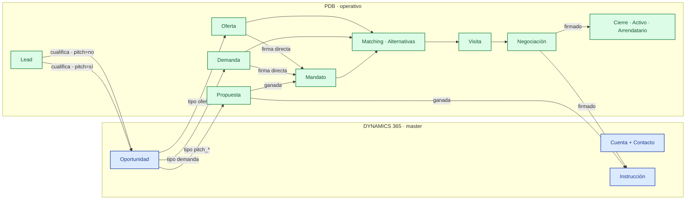
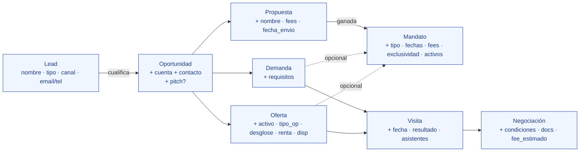

# PDB CRM — Procesos y campos por módulo

Documento ejecutivo de los procesos del CRM. Una **swim lane Dynamics / PDB** muestra el flujo end-to-end. Para cada módulo, una **tabla con los campos que el broker debe cumplimentar** (solo los nuevos — los que ya vienen heredados del módulo anterior se omiten).

---

## 1. Swim lane · Dynamics ↔ PDB

**Reglas de oro:**
- `Cuenta + Contacto + Oportunidad + Instrucción` viven en Dynamics. PDB las consume read-only (Instrucción es la única bidireccional).
- Todo lo demás (Lead, Propuesta, Demanda, Oferta, Mandato, Matching, Visita, Negociación) vive en PDB.
- El **Mandato es opcional**: la mayoría de demandas/ofertas operan sin mandato firmado (sub-brokering, búsqueda en paralelo).

---

## 2. Procesos × responsabilidades

| # | Proceso | Dynamics 365 | PDB |
|---|---|---|---|
| 1 | Captura del Lead | — | INSERT lead (`estado=nuevo`, `tipo`, `via=null`) |
| 2 | Cualificación | INSERT oportunidad (broker pide) | UPDATE lead `estado=cualificado` + INSERT entidad downstream |
| 3 | Pitch (Propuesta) | read-only opp | INSERT propuesta — broker la elabora |
| 4 | Ganar Pitch → Mandato | INSERT instrucción (`kickoff`) | INSERT mandato (`via=pitch`, FK propuesta) |
| 5 | Demanda directa | read-only opp | INSERT demanda + (opcional) firma mandato |
| 6 | Oferta directa | read-only opp | INSERT oferta + (opcional) firma mandato |
| 7 | Firma mandato directo (post-hoc) | INSERT instrucción | INSERT mandato (`via=directo`) + UPDATE demanda/oferta `mandato_id` |
| 8 | Matching | — | INSERT oferta_demanda (snapshot condiciones) |
| 9 | Envío al cliente | — | INSERT envios_ofertas + microsite |
| 10 | Visita | — | INSERT visita (FK alternativa + oferta + demanda + activo) |
| 11 | Negociación | — | INSERT negociación + iteraciones (jsonb diff) |
| 12 | Cierre / Firmado | UPDATE instrucción `cerrada` | UPDATE oferta `Ocupada total` + INSERT arrendatario + UPDATE stacking |
| 13 | Vencimiento — renovar | — | UPDATE arrendatario `fecha` + `estado_arr=Renovado` |
| 14 | Vencimiento — salir a mercado | — | INSERT oferta sell-side + UPDATE arrendatario `Finalizado` |
| 15 | Cancelación / Cierre Mandato | — | UPDATE mandato + decisión sobre ofertas (desvincular vs retirar) |

---

## 3. Campos por módulo (solo los que el broker debe rellenar)

> **Convención:** se omiten campos heredados (FK, equipo_trabajo, responsable cuando vienen del módulo anterior), generados (id, ref, timestamps), y read-only de Dynamics.

### 3.1 Lead — captura

Punto de entrada. Todos los campos son nuevos porque no hay módulo anterior.

| Campo | Tipo | Obl | Notas |
|---|---|:-:|---|
| `nombre` | text | ✓ | Nombre del lead/asunto |
| `tipo` | enum | ✓ | `oferta` · `demanda` · `generico` |
| `descripcion` | text |  | Descripción libre |
| `prioridad` | enum |  | `baja` · `media` · `alta` |
| `email` | text | * | Al menos uno (email o teléfono) para detectar duplicados |
| `telefono` | text | * |  |
| `origen_canal` | enum |  | `web` · `portal` · `linkedin` · `recomendacion` · `directo` |
| `origen_campana` | text |  | Campaña de origen (si aplica) |
| `origen_anuncio` | text |  | Anuncio concreto |
| `origen_url` | text |  | URL de la landing/portal |

### 3.2 Oportunidad (Dynamics) — cualificación

Se crea desde el modal `TransformarLeadModal`. **Hereda del Lead:** nombre, tipo (derivado de `lead.tipo + pitch?`).

| Campo | Tipo | Obl | Notas |
|---|---|:-:|---|
| `cuenta_dynamics_id` | FK | ✓ | Typeahead obligatorio. Si no existe la cuenta hay que crearla en Dynamics primero |
| `contacto_dynamics_id` | FK | ✓ | Typeahead obligatorio |
| `pitch` | bool | ✓ | Decisión del broker (SÍ → propuesta, NO → demanda/oferta directa) |
| `activo_id` | FK | * | Solo si pitch=NO + tipo=oferta |

### 3.3 Propuesta — solo vía pitch

Hereda de la Oportunidad: cuenta, oportunidad, equipo_trabajo (copia editable), nombre derivado del lead/cuenta.

| Campo | Tipo | Obl | Notas |
|---|---|:-:|---|
| `nombre` | text | ✓ | Editable; pre-rellenado con nombre de cuenta |
| `tipo` | enum |  | `Pitch` · `Valoración` · `Propuesta de servicios` · `Mandato comercial` · `Consultoría` · `Urbanismo` · `Proyecto arquitectura/workplace` |
| `linea` | enum |  | Línea de negocio |
| `fees` | numeric |  | Honorarios estimados |
| `fecha_envio` | date |  | Cuando se envía al cliente |
| `fecha_cierre` | date |  | Auto al ganar/perder |
| `motivo_descarte` | text | * | Si pasa a `perdida` |

### 3.4 Mandato (cascada Propuesta ganada)

`MarcarPropuestaGanadaModal`. Hereda: cuenta, oportunidad, propuesta_id, equipo_trabajo, responsable, nombre/título sugerido. Crea automáticamente la Instrucción Dynamics.

| Campo | Tipo | Obl | Notas |
|---|---|:-:|---|
| `fee_savills` | numeric | ✓ | € — va a la **Instrucción Dynamics** (lifetime fee) |
| `fecha_kickoff` | date | ✓ | Para la Instrucción Dynamics |
| `tipo` | enum | ✓ | `alquiler` · `venta` · `demanda` · `consultoria` (sugerido por tipo de oportunidad) |
| `fecha_firma` | date | ✓ | Default = hoy |
| `fecha_vencimiento` | date |  | Recomendable rellenar para alertas |
| `fee_eur_fijo` | numeric |  | Default = `fee_savills` |
| `fee_porcentaje` | numeric |  | Si el fee va por % sobre operación |
| `fee_min_garantizado` | numeric |  | Mínimo garantizado |
| `exclusividad_modo` | enum |  | Default `exclusiva`. Otra opción: `coexclusiva` (requiere agente externo) |
| `cuenta_agente_id` | FK | * | Solo si `exclusividad_modo=coexclusiva` |
| `activos_vinculados` | rel | * | Mandato_activos. Obligatorio si tipo `alquiler` o `venta` |
| `preaviso_dias` | int |  | Default 30 |
| `alerta_dias` | int |  | Default 60 (alertas en vencimiento) |
| `prorroga_tacita` | bool |  |  |
| `prorroga_meses` | int | * | Si `prorroga_tacita=true` |

### 3.5 Mandato (firma directa post-hoc)

`FirmarMandatoModal` desde Demanda u Oferta existentes. Hereda: cuenta, oportunidad, equipo_trabajo, FK al origen (`demandas.mandato_id` o `ofertas.mandato_id`). Si origen=oferta → activo se copia automáticamente a `mandato_activos`.

Mismos campos que §3.4 (todos nuevos relativos al origen).

### 3.6 Demanda — buy-side

Hereda de Lead/Oportunidad: cuenta, oportunidad, equipo_trabajo, nombre derivado.

| Campo | Tipo | Obl | Notas |
|---|---|:-:|---|
| `requisitos.uso` | enum | ✓ | `Oficinas` · `Logístico` · `Retail` · `Residencial` · `Hotel` · `Living` |
| `requisitos.sup_min` | numeric | ✓ | m² mínimos |
| `requisitos.sup_max` | numeric | ✓ | m² máximos |
| `requisitos.zonas` | array |  | Lista de zonas/submercados de interés |
| `requisitos.renta_max` | numeric |  | €/m²/mes máximo |
| `requisitos.fecha_disp` | date |  | Cuándo necesita ocupar |
| `notas` | text |  | Detalles libres |

### 3.7 Oferta — sell-side

Hereda: cuenta + oportunidad (de lead) o ninguno si la creación nace de un activo del portfolio. Activo es **obligatorio**.

| Campo | Tipo | Obl | Notas |
|---|---|:-:|---|
| `activo_id` | FK | ✓ | Activo a comercializar |
| `tipo_operacion` | enum | ✓ | `Alquiler` · `Venta` |
| `desglose_ofertas` | rel | ✓ | Al menos un espacio (ref interno + sup_min) |
| `renta` | numeric | * | €/m²/mes (alquiler) |
| `precio` | numeric | * | €/m² (venta) |
| `fecha_disponibilidad` | date | ✓ | Default = hoy. Si nace de un vencimiento → la fecha del vencimiento |
| `divisible` | bool |  | Default true |
| `confidencial` | bool |  | Toggle 🔒 |
| `asignaciones_stacking` | rel |  | Asignar el desglose a planta(s) del activo |
| `caracteristicas` | rel |  | Filtro de features del activo a incluir |
| `plazas_oferta` | rel |  | Plazas de parking incluidas |

### 3.8 Activo

No hereda de nada (es origen). Se da de alta directamente en el módulo Activos.

| Campo | Tipo | Obl | Notas |
|---|---|:-:|---|
| `ref` | text | ✓ | Slug único (ej. `MAD-OF-00189`) |
| `nombre` | text | ✓ | Nombre comercial |
| `direccion` | text | ✓ |  |
| `ciudad` | text | ✓ |  |
| `codigo_postal` | text |  |  |
| `zona` | text |  | Submercado |
| `uso` | enum | ✓ | `Oficinas` · `Logístico` · `Retail` · `Residencial` · `Living` · `Hotel` · `Industrial` |
| `sba` | numeric | ✓ | Superficie bruta arrendable total m² |
| `sba_neta` | numeric |  |  |
| `n_edificios` | int |  | Default 1 |
| `coordenadas` | point |  | Latitud / longitud |
| `anno_construccion` | int |  |  |
| `anno_rehabilitacion` | int |  |  |
| `calidad` | enum |  | `Prime` · `A` · `B` · `C` |
| `leed` / `breeam` / `well` | enum |  | Certificaciones |
| `stacking_data` | jsonb | ✓ | Estructura de edificios + plantas (editor visual) |

### 3.9 Propietario (sobre activo)

Hereda: `activo_ref` (auto del flujo desde el activo). El propietario en sí (cuenta) se busca en Dynamics.

| Campo | Tipo | Obl | Notas |
|---|---|:-:|---|
| `propietario` | FK Cuenta | ✓ | Typeahead Dynamics |
| `tipologia` | enum |  | `Asset deal` · `Share deal` · ... |
| `anyo_compra` | int | ✓ |  |
| `trimestre` | enum | ✓ | `Q1` · `Q2` · `Q3` · `Q4` |
| `precio_compra` | text |  | Soporta texto (ej. "130 M€") |
| `regimen` | enum |  | Default `Propiedad 100%` |
| `perfil` | enum |  | `Core` · `Core+` · `Value-add` · `Opportunistic` |
| `estrategia` | enum |  | `Hold` · `Sell` · `Reposicionamiento` |
| `cap_rate` / `yield_pct` / `tir_objetivo` | numeric |  |  |
| `ltv` / `financiacion` / `banco` | mixed |  | Estructura de deuda |
| **Asignación al stacking** | drag&drop | ✓ | Sin arrastrar al stacking, el alta queda incompleta |

### 3.10 Arrendatario (sobre activo)

Hereda: `activo_ref` (auto). Si nace de cierre de oferta → `prefilledTenant`, `prefilledSup`, `fromFloorId` también heredados.

| Campo | Tipo | Obl | Notas |
|---|---|:-:|---|
| `tenant` | text | * | Nombre del inquilino. Si `tenant_desconocido=true`, se omite |
| `tenant_desconocido` | bool |  | Toggle si no se conoce el inquilino actual |
| `persona_fisica` | bool |  |  |
| `superficie` | numeric | ✓ | m² ocupados |
| `closing_rent` | numeric | ✓ | €/m²/mes acordada |
| `asking_rent` | numeric |  | Renta inicial (anti-)pedida |
| `fecha_inicio` | date | ✓ |  |
| `fecha_fin` | date | ✓ | Vencimiento contractual |
| `break_option` | date |  | Para alertas |
| `meses_carencia` | int |  |  |
| `meses_recordatorio` | int |  | Default 3 (alertar antes del break) |
| `tipo_contrato` | enum |  | LAU, LAU comercial, etc. |
| `anios_obligado` | numeric |  | Periodo de obligatoriedad |
| `aportacion_obras_m2` | numeric |  | TI / fit-out aportado |
| `agente_activo` / `agente_pasivo` | text |  |  |
| `sector` | text |  | Sector del inquilino |
| `color` | hex |  | Color del chip en el stacking |
| **Asignación al stacking** | drag&drop | ✓ | Auto si nace de cierre de oferta; si no, manual |

### 3.11 Negociación

Hereda: oferta_id, oferta_demanda_id, demanda_id, cuenta_inquilina_id, cuenta_propietaria_id (todas auto del contexto).

| Campo | Tipo | Obl | Notas |
|---|---|:-:|---|
| `condiciones_acordadas` | jsonb |  | Diff acumulado de las condiciones (renta, carencia, plazos, obras...) |
| `documentos_versionados` | jsonb |  | Array de versiones de borrador de contrato |
| `fee_savills_estimado` | numeric |  | Estimación de honorarios |
| `fecha_cierre` | date | * | Al cerrar |
| `motivo_perdida` | text | * | Si rechazado |

### 3.12 Visita

Hereda: oferta_demanda_id, oferta_id, activo_id, demanda_id (todos auto).

| Campo | Tipo | Obl | Notas |
|---|---|:-:|---|
| `fecha` | datetime | ✓ |  |
| `asistentes` | jsonb |  | Lista de asistentes (broker, cliente, propietario...) |
| `resultado` | enum | * | `positiva` · `neutral` · `negativa` (al completar) |
| `notas` | text |  |  |

### 3.13 Actividad (transversal)

Cualquier ficha tiene un botón "+ Nueva actividad". Las FKs se rellenan automáticamente según el contexto desde el que se crea.

| Campo | Tipo | Obl | Notas |
|---|---|:-:|---|
| `tipo` | enum | ✓ | `email` · `llamada` · `reunion` · `nota` · `tarea` |
| `asunto` | text | ✓ |  |
| `descripcion` | text |  |  |
| `fecha` | datetime | ✓ |  |
| `asignado_a` | text |  | Default = usuario actual |
| `estado` | enum |  | Default `abierto`; pasa a `completado`/`cancelado` |

---

## 4. Resumen visual · qué se hereda al cascadear

Cada nodo lista solo los campos **nuevos** del paso. Los anteriores se heredan automáticamente.

---

**Fin del documento**
